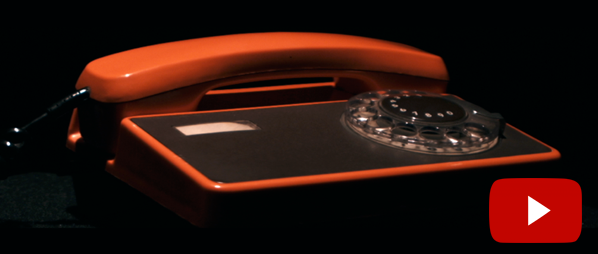

# Dialrhea - revolutionary shitty machine

Dialrhea is a device made from old rotary phone. It acts as a Bluetooth LE keyboard, can be paired with compatible devices and control them. Three unique modes of operation offer endless possibilities. You can find full article with videos, pictures and the whole story at [https://tamulaitis.lt/project/dialrhea](https://tamulaitis.lt/project/dialrhea).

## How does it work?

Here is a promotional demo video for the device: [https://youtu.be/RVSE1t3wHlI](https://youtu.be/RVSE1t3wHlI)

Here is video of Dialrhea in action at various events: [https://youtu.be/YNjw6ZKlyNM](https://youtu.be/YNjw6ZKlyNM)

And here you can find trippy video about how we made it: [https://youtu.be/nAaBJcYIFyU](https://youtu.be/nAaBJcYIFyU)

## Modes of operation

Dialrhea supports three distinct modes of operation: 

* Doom - in this mode the device acts as a game controller configured to work with original "Doom" games (using Doomsday Engine)
* Emoji - this mode is best used with mobile phones and allows you to type emoji's and send them to your friends
* Boring - in this mode Dialrhea just outputs the dialed numbers (not recommended)

## Hardware

Dialrhea runs on any Arduino board, but was only tested on Arduino Leonardo. It requires [Adafruit Bluefruit LE UART Friend](https://learn.adafruit.com/introducing-the-adafruit-bluefruit-le-uart-friend) module to be connected. If you really want to make your own Dialrhea just contact me and I will tell you how to do it.

## Dependencies

The code requires [Adafruit_BluefruitLE_nRF51](https://github.com/adafruit/Adafruit_BluefruitLE_nRF51) library to be installed into Arduino IDE to run.

## Disclamer

The device was made during a weekend in hackathon called Internet of Shit so expect the code to be pretty shitty.
